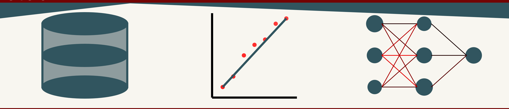

# SVG

## SVG Graphics and Animations:

SVG, which stands for Scalable Vector Graphics, is an XML-based markup language for describing two-dimensional vector graphics. SVG is used to define graphics for the Web, is a W3C standard, and offers a powerful and flexible option for web and graphic designers to create scalable, interactive, and efficient graphics for the web. 

## Features and Benefits of SVG:

1. Scalability and Resolution Independence:
SVG graphics are scalable, meaning they can be resized without loss of quality. This makes them ideal for a wide range of devices with different resolutions, from small smartphones to large desktop monitors.

2. File Size and Compression:
SVG files are often smaller than their bitmap counterparts (JPEG, PNG, etc.), especially for designs that are geometrically simple. SVG graphics can be compressed to further reduce file sizes, making web pages load faster.

3. Editability and Accessibility:
Being XML-based, SVG graphics can be created and edited with any text editor and can be manipulated via CSS and JavaScript. This makes SVG a flexible option for dynamic, interactive web content. SVGs can contain text, which can be indexed by search engines and read by screen readers, improving accessibility and SEO.

4. Interactivity and Animation:
SVG supports user interactions and animations directly within the SVG markup. Elements within an SVG graphic can respond to user events such as mouse clicks or hover, and animations can be defined without the need for external libraries.

5. Integration:
SVG can be embedded directly into HTML web pages, loaded as external files, or inlined within HTML. This flexibility allows for efficient use of SVG in web development workflows.

6. Styling:
SVG elements can be styled with CSS, allowing for a separation of presentation and content. Styles can be applied inline, within the SVG itself, or externally via CSS stylesheets.

7. DOM Interface:
SVG elements are part of the Document Object Model (DOM), which means they can be accessed and manipulated using JavaScript just like HTML elements. This enables dynamic changes to the graphics based on user interaction or other conditions.

## Use Cases

Logos and icons that need to scale cleanly at any size.
Charts, diagrams, and visualizations that benefit from being scalable and interactive.
Complex animations and interactive applications within web pages.
